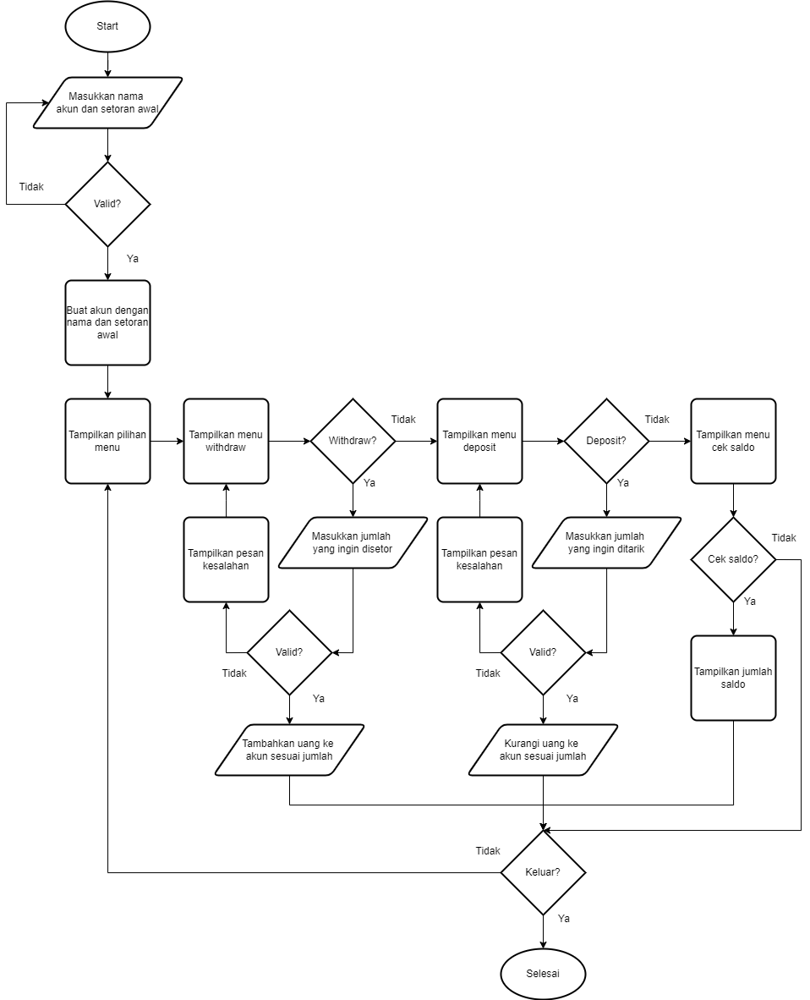
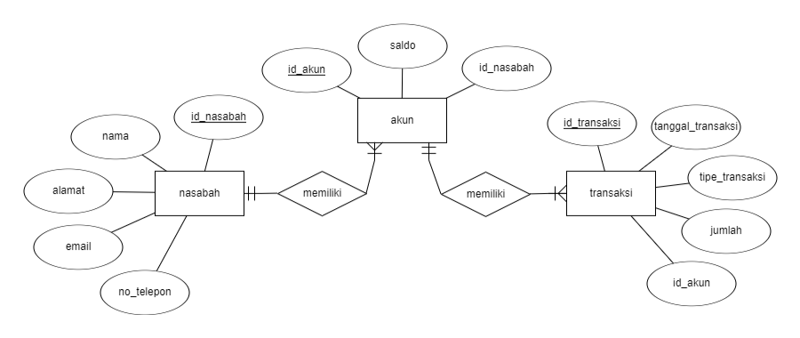

<h1 align="center">Basic Banking System - Chapter 2</h1>

Ahmad Subhan Daryhadi - BEJS#1

## Tentang Tugas
Sebuah sistem bank sederhana yang mengimplementasikan hal-hal yang sudah dipelajari dalam materi Chapter 2. Hal ini meliputi flowchart, error handling, proses asinkronus, oop, dan git

## Fitur Utama
User dapat membuat akun bank dengan nama dan deposit awal tertentu. Beberapa fungsi utama yang dapat dijalankan:
- Deposit: Memasukkan saldo
- Widthdraw: Mengambil saldo
- GetBalance: Mengecek saldo

## Flowchart
Berikut adalah flowchart yang menggambarkan bagaimana proses yang terjadi
  

<h1 align="center">Basic Banking System - Chapter 3</h1>

Ahmad Subhan Daryhadi - BEJS#1

## Tentang Tugas
Sebuah sistem bank sederhana yang mengimplementasikan hal-hal yang sudah dipelajari dalam materi Chapter 3. Hal ini meliputi erd, query language, dan optimisasinya.

## ERD
Berikut adalah erd yang menggambarkan bagaimana database yang dibentuk
  